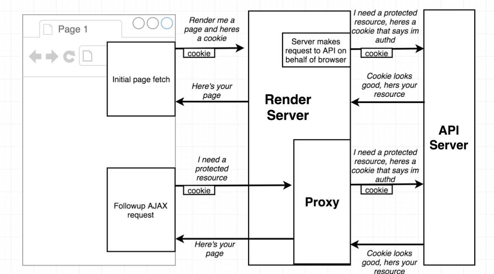
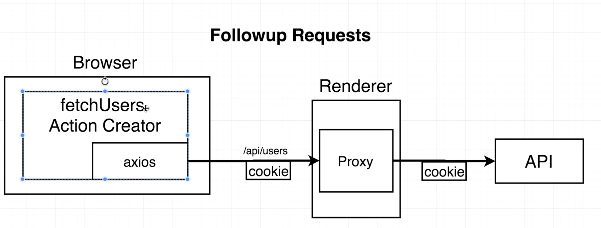
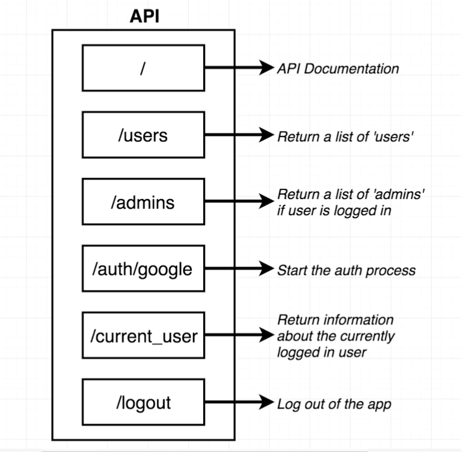

1. Установили зависимости:

    ```
    "dependencies": {
        "axios": "0.16.2",
        "babel-cli": "6.26.0",
        "babel-core": "6.26.0",
        "babel-loader": "7.1.2",
        "babel-preset-env": "1.6.0",
        "babel-preset-es2015": "6.24.1",
        "babel-preset-es2017": "6.24.1",
        "babel-preset-react": "6.24.1",
        "babel-preset-stage-0": "6.24.1",
        "compression": "1.7.0",
        "concurrently": "3.5.0",
        "express": "4.15.4",
        "express-http-proxy": "1.0.6",
        "lodash": "4.17.4",
        "nodemon": "1.12.0",
        "npm-run-all": "4.1.1",
        "react": "16.0.0",
        "react-dom": "16.0.0",
        "react-helmet": "5.2.0",
        "react-redux": "5.0.6",
        "react-router-config": "1.0.0-beta.4",
        "react-router-dom": "4.2.2",
        "redux": "3.7.2",
        "redux-thunk": "2.2.0",
        "serialize-javascript": "1.4.0",
        "webpack": "3.5.6",
        "webpack-dev-server": "2.8.2",
        "webpack-merge": "4.1.0",
        "webpack-node-externals": "1.6.0"
    },
    ```

- Сервер генерит только HTML и ничего не знает про JS, поэтому мы должны генерить разные бандлы: один для сервера, другой для клиента. Создаем разные Webpack конфигурации.
- Точки входа для сервера и клиента должны различаться.
- Используем `const nodeExternals = require('webpack-node-externals');`, чтобы сократить размер серверного бандла.

API http://react-ssr-api.herokuapp.com/


Общая схема запросов к API:



Первоначальный запрос к API:


Последующие запросы к API:



API Docs:

